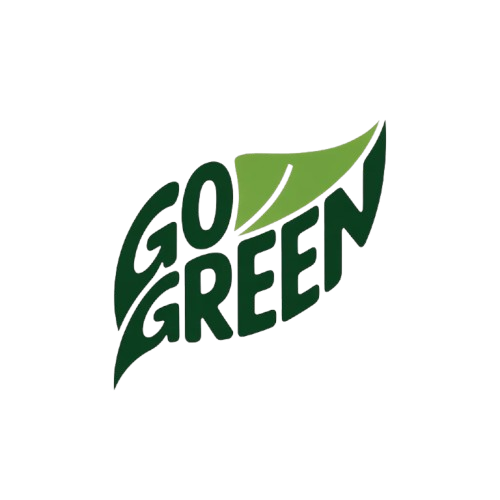
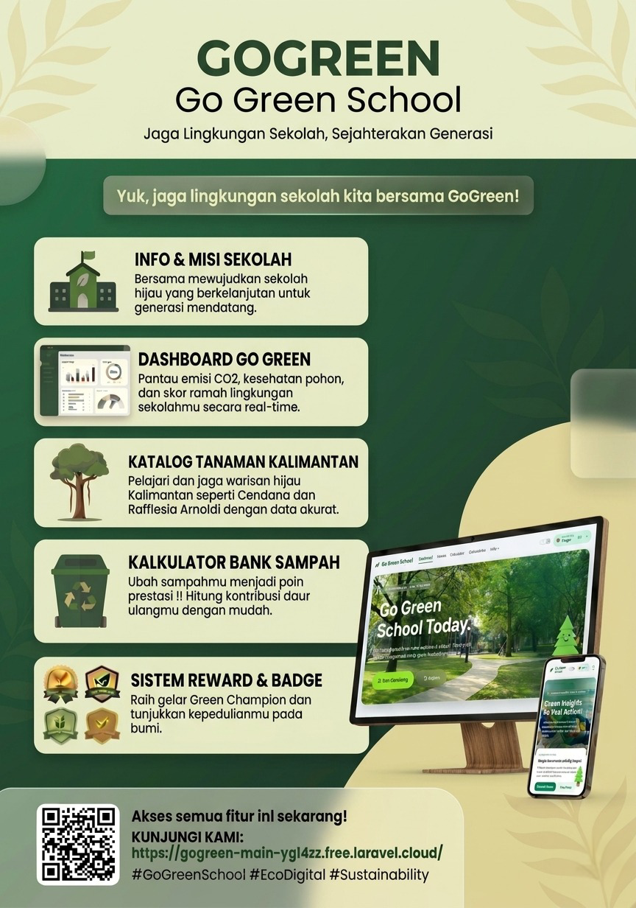
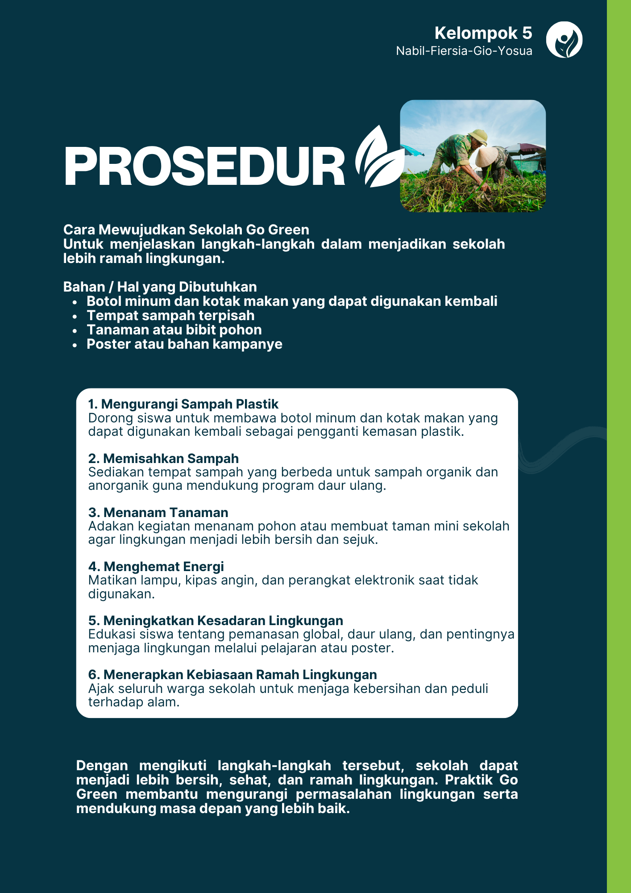
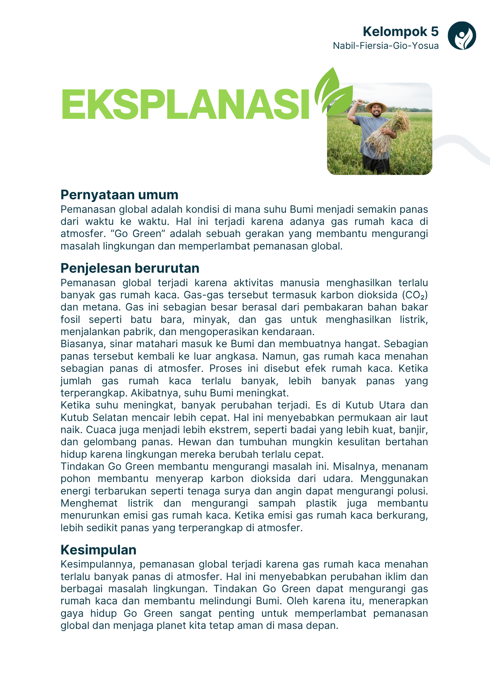

  

<h1 align="center">🌿GO GREEN SCHOOL🌿</h1>

  Website edukasi lingkungan berbasis Laravel 11 untuk pembelajaran sekolah hijau.

  
  
  
  
  

---

## 🌿 Tentang Proyek

Go Green School adalah website edukasi lingkungan yang berisi:

- Dashboard interaktif bertema lingkungan
- Informasi tanaman dan edukasi penghijauan
- Kalkulator bank sampah
- Artikel edukasi lingkungan
- Halaman profil sekolah, about team, dan contact
- Dukungan multi-bahasa (id, en, ja, vi, fil, th)
- Panel admin Filament

## 🚀 Fitur Publik

- **Dashboard** — Hero section dengan fitur interaktif, informasi gerakan hijau, dan call-to-action
- **Tanaman** — Katalog informasi 5 tanaman khas Kalimantan Barat dengan deskripsi detail
- **Kalkulator Bank Sampah** — Kalkulator interaktif untuk 6 jenis sampah (plastik, kertas, logam, kaca, organik, elektronik)
- **Artikel Edukasi** — Koleksi artikel tentang lingkungan, daur ulang, dan keberlanjutan
- **Halaman Tentang (About)** — Profil tim pengembang dengan flip-card interaktif
- **Profil Sekolah** — Informasi lengkap sekolah dan visi misi Go Green School
- **Hubungi Kami** — Form contact dengan validasi dan pengiriman email notification
- **Maskot Interaktif** — Karakter animasi yang menemani pengguna di beberapa halaman untuk meningkatkan engagement dan experience pengguna

### 🎨 User Interface & UX

- **Dark Mode Toggle** — Mode gelap dengan styling responsif dan glow effects pada elemen penting
- **Multi-Language Support** — 6 bahasa: Bahasa Indonesia, English, 日本語 (Jepang), Tiếng Việt (Vietnam), Filipino, ไทย (Thailand)
- **Responsive Design** — Optimasi penuh untuk mobile dan desktop dengan media queries custom
- **Design System** — Konsistensi komponen visual (badge, button, card, modal) di semua halaman
- **Animasi Smooth** — Transisi halus pada hover, scroll effects, dan modal interactions

### 🧮 Fitur Kalkulator

- **Multi-Jenis Sampah** — Perhitungan poin untuk 6 kategori sampah dengan tabel poin per kg
- **Input Fleksibel** — Support input dengan titik sebagai pemisah desimal
- **Validasi Real-time** — Validasi form input dengan error handling yang user-friendly
- **Hasil Terperinci** — Ringkasan poin per jenis sampah dan total poin sampah

### 🔧 Teknologi & Infrastructure

- **Framework Laravel 11** — Full-stack PHP framework dengan fitur modern
- **Livewire 3** — Real-time components tanpa page reload
- **Tailwind CSS Custom** — Styling dengan utility-first CSS framework
- **Session-Based Localization** — Manajemen bahasa via session, bukan database
- **Asset Pipeline Vite** — Fast development server dan optimasi build production

## 👥 Pembagian Tugas Tim

Berikut rincian kontribusi setiap anggota tim dalam pengembangan proyek Go Green School.

- Nabil Aqbar Kurnia Wijaya Putra
  - Lead developer dan systems architect
  - Merancang arsitektur sistem website secara menyeluruh
  - Mengelola fitur-fitur utama (dashboard, kalkulator, dan lainnya)
  - Menambahkan fitur berbagai Bahasa(id, en, ja, vi, fil, dan th)

- Fiersia Vinderly
  - UI/UX designer
  - Design system
  - Menjaga konsistensi komponen visual dan alur tampilan website
  - Mendesain Poster Go Green School untuk mata pelajaran Digital Marketing dan poster mata pelajaran Bahasa Indonesia
  - Membuat Logo Go Green School untuk Website 

- Yosua
  - Content & documentation
  - Menangani proses editing video promosi
  - Mengelola publikasi dan aktivitas media sosial proyek
  - Mengelola media sosial bersama tim publikasi

- Giovinco
  - Content & documentation
  - Mengelola proses pengambilan footage video proyek
  - Menyusun konten edukatif dan dokumentasi proyek
  - Mengembangkan ide dan konsep kreatif untuk konten promosi
  - Berfokus pada perencanaan konten

## 🎨 Dokumentasi Poster & Desain Website

**Poster Tampilan & Fitur Website (Digital Marketing)**

---

**Poster Edukasi - Teks Eksplanasi (Bahasa Indonesia)**

---

**Poster Edukasi - Teks Prosedur (Bahasa Indonesia)**

---

## 🎬 Video Promosi

Selain pembuatan poster dan website, proyek Go Green School juga dilengkapi dengan video promosi berkualitas. Anda dapat menonton dan membagikan video promosi kami melalui tautan berikut:

**[Video Promosi (Facebook)](https://www.facebook.com/share/1Dh2CRhKnV/)**
