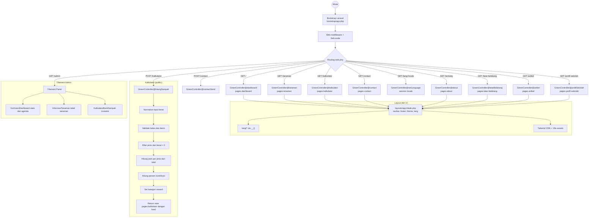

<p align="center"><a href="https://laravel.com" target="_blank"></a></p>

<p align="center">
<a href="https://github.com/laravel/framework/actions"></a>
<a href="https://packagist.org/packages/laravel/framework"></a>
<a href="https://packagist.org/packages/laravel/framework"></a>
<a href="https://packagist.org/packages/laravel/framework"></a>
</p>

## Go Green School

Website edukasi lingkungan berbasis Laravel 11 yang menampilkan informasi tanaman khas daerah, kalkulator bank sampah, artikel edukasi, profil sekolah, dan panel admin Filament tanpa autentikasi.

### Fitur Utama

- Dashboard publik dengan navigasi info sekolah dan artikel
- Informasi tanaman (list + modal detail) dengan data hardcoded
- Kalkulator bank sampah (validasi server + estimasi client + chart)
- Form kontak (kirim email ke alamat tujuan)
- Multi-bahasa via session (id, en, ja, vi, fil, th)
- Panel admin Filament di `/admin` (tanpa login, tanpa database)

### Halaman Publik (Routes)

- GET `/` - dashboard
- GET `/tanaman` - informasi tanaman
- GET `/kalkulator` - form kalkulator
- POST `/kalkulator` - proses hitung poin
- GET `/artikel` - artikel edukasi
- GET `/tentang` - tentang proyek
- GET `/latar-belakang` - latar belakang masalah
- GET `/profil-sekolah` - profil sekolah
- GET `/contact` - form kontak
- POST `/contact` - kirim pesan kontak
- GET `/lang/{locale}` - ganti bahasa (session)

### Panel Admin (Filament)

- GET `/admin` - dashboard admin
- Page: GoGreenDashboard (statistik + agenda, hardcoded)
- Page: InformasiTanaman (tabel tanaman, hardcoded)
- Page: KalkulatorBankSampah (Livewire state, tanpa DB)

### Data dan Penyimpanan

- Data utama disimpan sebagai array hardcoded (tanpa database)
- Session dipakai untuk locale dan flash message
- Kalkulator publik menghitung di server, hasil ditampilkan di UI
- Kalkulator Filament menghitung di Livewire state (memory)

### Mail Kontak

- Email tujuan diambil dari `MAIL_CONTACT_TO`
- Jika tidak diset, fallback ke `MAIL_FROM_ADDRESS`
- Mailer default: `log` (lihat `config/mail.php`)

### Lokalisasi

- Bahasa aktif disimpan di session oleh route `/lang/{locale}`
- Middleware `SetLocale` membaca session dan set locale aplikasi

### Alur Sistem (Mermaid)



## Setup Proyek (First Run)

Panduan ini untuk teman tim setelah `git pull` di Herd, Laragon, atau lingkungan lokal lain.

### Requirement

- PHP 8.3+ (disarankan 8.4 jika tersedia)
- Composer
- Node.js dan npm
- Extension PHP database sesuai driver yang dipakai:
  - SQLite: `pdo_sqlite` dan `sqlite3`
  - MySQL: `pdo_mysql`

### Langkah Cepat Setelah Pull

1. Install dependency backend:

	```bash
	composer install
	```

2. Siapkan file environment:

	```bash
	cp .env.example .env
	```

3. Generate app key:

	```bash
	php artisan key:generate
	```

4. Install dependency frontend dan build Vite:

	```bash
	npm install
	npm run build
	```

5. Setup database (pilih salah satu opsi di bawah), lalu jalankan migrasi:

	```bash
	php artisan migrate
	```

6. Jalankan aplikasi:

	```bash
	php artisan serve
	```

### Opsi Database: SQLite (Paling Cepat untuk Development)

1. Set di `.env`:

	```env
	DB_CONNECTION=sqlite
	DB_DATABASE=database/database.sqlite
	```

2. Buat file database:

	```bash
	mkdir -p database
	type nul > database/database.sqlite
	```

Jika muncul error `could not find driver`, aktifkan extension `pdo_sqlite` dan `sqlite3` di `php.ini` yang dipakai CLI.

### Opsi Database: MySQL (Herd/Laragon)

Set `.env` sesuai database lokal:

```env
DB_CONNECTION=mysql
DB_HOST=127.0.0.1
DB_PORT=3306
DB_DATABASE=gogreenschool
DB_USERNAME=root
DB_PASSWORD=
```

Pastikan databasenya sudah dibuat dulu di MySQL, kemudian jalankan `php artisan migrate`.

## About Laravel

Laravel is a web application framework with expressive, elegant syntax. We believe development must be an enjoyable and creative experience to be truly fulfilling. Laravel takes the pain out of development by easing common tasks used in many web projects, such as:

- [Simple, fast routing engine](https://laravel.com/docs/routing).
- [Powerful dependency injection container](https://laravel.com/docs/container).
- Multiple back-ends for [session](https://laravel.com/docs/session) and [cache](https://laravel.com/docs/cache) storage.
- Expressive, intuitive [database ORM](https://laravel.com/docs/eloquent).
- Database agnostic [schema migrations](https://laravel.com/docs/migrations).
- [Robust background job processing](https://laravel.com/docs/queues).
- [Real-time event broadcasting](https://laravel.com/docs/broadcasting).

Laravel is accessible, powerful, and provides tools required for large, robust applications.

## Learning Laravel

Laravel has the most extensive and thorough [documentation](https://laravel.com/docs) and video tutorial library of all modern web application frameworks, making it a breeze to get started with the framework. You can also check out [Laravel Learn](https://laravel.com/learn), where you will be guided through building a modern Laravel application.

If you don't feel like reading, [Laracasts](https://laracasts.com) can help. Laracasts contains thousands of video tutorials on a range of topics including Laravel, modern PHP, unit testing, and JavaScript. Boost your skills by digging into our comprehensive video library.

## Laravel Sponsors

We would like to extend our thanks to the following sponsors for funding Laravel development. If you are interested in becoming a sponsor, please visit the [Laravel Partners program](https://partners.laravel.com).

### Premium Partners

- **[Vehikl](https://vehikl.com)**
- **[Tighten Co.](https://tighten.co)**
- **[Kirschbaum Development Group](https://kirschbaumdevelopment.com)**
- **[64 Robots](https://64robots.com)**
- **[Curotec](https://www.curotec.com/services/technologies/laravel)**
- **[DevSquad](https://devsquad.com/hire-laravel-developers)**
- **[Redberry](https://redberry.international/laravel-development)**
- **[Active Logic](https://activelogic.com)**

## Contributing

Thank you for considering contributing to the Laravel framework! The contribution guide can be found in the [Laravel documentation](https://laravel.com/docs/contributions).

## Code of Conduct

In order to ensure that the Laravel community is welcoming to all, please review and abide by the [Code of Conduct](https://laravel.com/docs/contributions#code-of-conduct).

## Security Vulnerabilities

If you discover a security vulnerability within Laravel, please send an e-mail to Taylor Otwell via [taylor@laravel.com](mailto:taylor@laravel.com). All security vulnerabilities will be promptly addressed.

## License

The Laravel framework is open-sourced software licensed under the [MIT license](https://opensource.org/licenses/MIT).
